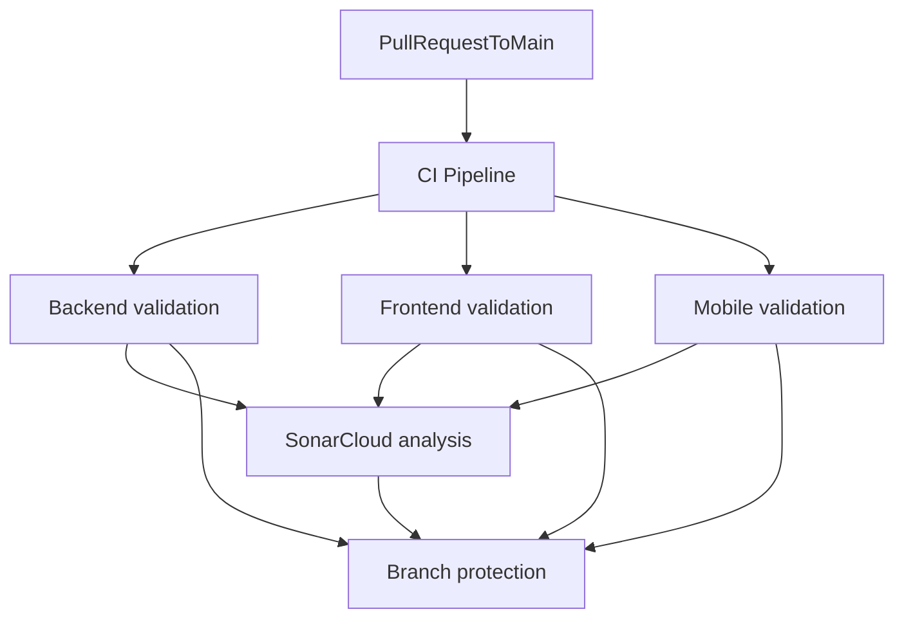

# CI/CD Runbook

This document describes the GitHub Actions CI pipeline, local parity commands, SonarCloud setup, and rollout guidance for **wealth-stack**.

## Workflows

| Workflow | File | Trigger | Purpose |
|----------|------|---------|---------|
| **CI Pipeline** | [`.github/workflows/ci.yml`](../.github/workflows/ci.yml) | PR / push to `main` | Orchestrates all module checks, then SonarCloud |
| Backend CI | [`.github/workflows/backend-ci.yml`](../.github/workflows/backend-ci.yml) | Called by CI pipeline (or manual dispatch) | Go lint, unit tests, integration tests, race detector, coverage |
| Frontend CI | [`.github/workflows/frontend-ci.yml`](../.github/workflows/frontend-ci.yml) | Called by CI pipeline (or manual dispatch) | ESLint, TypeScript, build, Vitest coverage |
| Mobile CI | [`.github/workflows/mobile-ci.yml`](../.github/workflows/mobile-ci.yml) | Called by CI pipeline (or manual dispatch) | ESLint, TypeScript, Jest coverage |
| Sonar Analysis | [`.github/workflows/sonar.yml`](../.github/workflows/sonar.yml) | Called by CI pipeline after all modules pass | SonarCloud scan + quality gate |

The **CI Pipeline** runs backend, frontend, and mobile validation **in parallel**, then runs SonarCloud analysis **last** using coverage artifacts from those jobs.



## Local parity commands

```bash
# Full CI (backend + frontend + mobile)
make ci

# Per stack
make backend-ci
make frontend-ci
make mobile-ci
```

Install dependencies once at the **repository root** (`npm install`) so workspaces link `@wealth-stack/shared`.

## Required secrets

| Secret | Required | Purpose |
|--------|----------|---------|
| `SONAR_TOKEN` | Yes (Sonar workflow) | SonarCloud analysis and quality gate |
| `GITHUB_TOKEN` | Automatic | PR decoration |

### SonarCloud setup

1. Create a project at [SonarCloud](https://sonarcloud.io) linked to your repository.
2. Confirm `sonar.organization` in [`sonar-project.properties`](../sonar-project.properties).
3. Add `SONAR_TOKEN` under **GitHub → Settings → Secrets and variables → Actions**.
4. **Disable Automatic Analysis** in SonarCloud: **Project → Administration → Analysis Method**.

## Branch protection (recommended)

Required checks from the CI Pipeline:

- `Backend validation`
- `Frontend validation`
- `Mobile validation`
- `SonarCloud analysis`

## Coverage thresholds

| Stack | Sonar import | Tool |
|-------|--------------|------|
| Backend | `reports/coverage/backend/coverage.out` | Go `coverprofile` |
| Frontend | `reports/coverage/web/lcov.info` | Vitest lcov |
| Mobile | `reports/coverage/mobile/lcov.info` | Jest lcov |

Generate all reports: `bash scripts/generate-all-coverage.sh`

## Future (out of scope)

- EAS Build for Android/iOS release artifacts
- TestFlight and Play Store deployment pipelines
