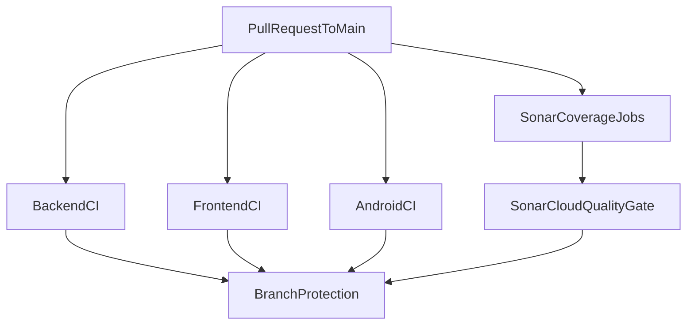

# CI/CD Runbook

This document describes the GitHub Actions CI pipeline, local parity commands, SonarCloud setup, and rollout guidance for **wealth-stack**.

## Workflows

| Workflow | File | Trigger | Purpose |
|----------|------|---------|---------|
| Backend CI | [`.github/workflows/backend-ci.yml`](../.github/workflows/backend-ci.yml) | PR / push to `main` (backend paths) | Go lint, unit tests, integration tests, race detector, coverage |
| Frontend CI | [`.github/workflows/frontend-ci.yml`](../.github/workflows/frontend-ci.yml) | PR / push to `main` (web paths) | ESLint, TypeScript, build, Vitest coverage |
| Android CI | [`.github/workflows/android-ci.yml`](../.github/workflows/android-ci.yml) | PR / push to `main` (android paths) | Unit tests, lint (**JDK 23**) |
| Sonar Analysis | [`.github/workflows/sonar.yml`](../.github/workflows/sonar.yml) | PR / push to `main` | SonarCloud scan + quality gate |

All workflows use **concurrency groups** with `cancel-in-progress: true` to avoid redundant runs when new commits are pushed to the same PR.



## Local parity commands

Run the same checks locally before opening a PR:

```bash
# Full CI (backend + frontend + Android)
make ci

# Per stack
make backend-ci
make frontend-ci
make android-ci

# Individual targets
make test-unit
make test-integration   # requires Docker
make test-race
make backend-coverage
make android-test       # requires JDK 23+ and Android SDK
make android-lint
make lint
```

Windows without `make`:

```powershell
# Backend
cd backend
go vet ./...
go test ./internal/auth/...

# Web
cd web
npm ci
npm run lint
npm run typecheck
npm run build
npm run coverage

# Android (JDK 23+ required)
$env:JAVA_HOME = "C:\Program Files\Eclipse Adoptium\jdk-23"
cd android
.\gradlew.bat testDebugUnitTest
.\gradlew.bat lintDebug
```

## Required secrets

| Secret | Required | Purpose |
|--------|----------|---------|
| `SONAR_TOKEN` | Yes (Sonar workflow) | SonarCloud analysis and quality gate |
| `GITHUB_TOKEN` | Automatic | PR decoration (provided by GitHub Actions) |

### SonarCloud setup

1. Create a project at [SonarCloud](https://sonarcloud.io) linked to `Valyo96/wealth-stack`.
2. Confirm `sonar.organization` in [`sonar-project.properties`](../sonar-project.properties) matches your SonarCloud organization key.
3. Add `SONAR_TOKEN` under **GitHub → Settings → Secrets and variables → Actions**.
4. Install the SonarCloud GitHub App for PR decoration and quality gate status.

## Branch protection (recommended)

After 2–5 days of stable CI runs, enable for `main`:

1. **Require status checks:**
   - `Backend validation`
   - `Frontend validation`
   - `Android validation`
   - `SonarCloud analysis`
2. **Require branches to be up to date** (optional; increases rebase overhead).
3. Do **not** rename workflow job names without updating branch protection rules.

## Failure triage

| Symptom | Likely cause | Action |
|---------|--------------|--------|
| Backend integration test timeout | Docker unavailable or slow Postgres startup | Re-run job; verify Docker on runner |
| Coverage threshold failure | New code without tests | Add unit/integration tests |
| golangci-lint failure | Style/static analysis issue | Run `golangci-lint run` in `backend/` |
| Sonar quality gate failure | Code smells, duplication, or coverage regression | Review SonarCloud report on PR |
| `SONAR_TOKEN` missing | Secret not configured | Add secret or skip Sonar until configured |
| Fork PR skips Sonar | Secrets unavailable for forks | Expected; maintainers can run Sonar on merge |

## Rollout and rollback

### Rollout order

1. Merge workflow files (checks run but are not required).
2. Configure SonarCloud + `SONAR_TOKEN`.
3. Validate on active PRs for 2–5 days.
4. Enable branch protection required checks.

### Rollback

1. Disable required checks in branch protection (immediate unblock).
2. Revert workflow commits if needed.
3. Keep workflows running in informational mode while fixing issues.

## Observability

- **Logs:** Each workflow step is named for quick scanning in GitHub Actions.
- **Artifacts:** Backend (`backend-coverage`) and frontend (`frontend-coverage`) coverage files retained 5 days.
- **Metrics to watch:** Workflow duration, failure rate, flaky integration tests, median PR validation time.
- **Alerting:** GitHub email/notifications for failed required checks.

## Coverage thresholds

SonarCloud **does not run tests or compute coverage** — see **[Coverage guide](coverage.md)** for how each stack generates reports.

| Stack | Sonar import | Tool |
|-------|--------------|------|
| Backend | `reports/coverage/backend/coverage.out` | Go `coverprofile` |
| Frontend | `reports/coverage/web/lcov.info` | Vitest lcov (+ Cobertura XML artifact) |
| Android | `reports/coverage/android/jacocoTestReport.xml` | **JaCoCo** |

Generate all reports locally: `bash scripts/generate-all-coverage.sh`

### CI-enforced thresholds (pre-Sonar)

| Stack | Threshold | Enforced by |
|-------|-----------|-------------|
| Backend | 1% (configurable via `MIN_BACKEND_COVERAGE`) | `scripts/check-backend-coverage.sh` |
| Frontend | 1% lines/functions/branches/statements | `web/vitest.config.ts` |

Raise thresholds incrementally as test coverage grows.

## Security notes

- Never commit `SONAR_TOKEN` or other secrets.
- Fork PRs skip Sonar analysis (no access to repository secrets).
- Integration tests use ephemeral Postgres containers; no production credentials are used.

## Out of scope (future)

- Docker image builds and registry push
- Deployment pipelines and preview environments
- SAST/DAST, OpenTelemetry validation, browser E2E, release automation
